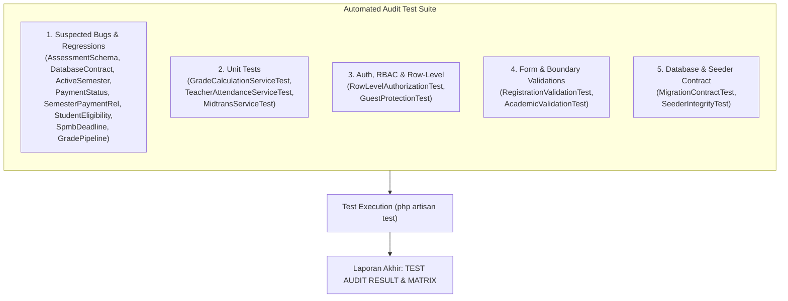

# Implementation Plan: Comprehensive Codebase Audit & Automated Test Suite

Audit menyeluruh terhadap codebase Laravel Rumah Qur'an Asy-Syams (YPTQ) untuk memverifikasi bug yang dicurigai (*suspected bugs*), mismatch skema database, integritas seeder/relasi, kesenjangan otorisasi (*row-level authorization gaps*), dan celah validasi (*validation gaps*) dengan membangun test suite terotomatisasi lengkap sesuai panduan [rule.md](file:///d:/Kuliah/joki/fiki/asysyams/.agents/rule/rule.md), [laravel-specialist](file:///d:/Kuliah/joki/fiki/asysyams/.agents/skills/laravel-specialist/SKILL.md), dan [security-and-hardening](file:///d:/Kuliah/joki/fiki/asysyams/.agents/skills/security-and-hardening/SKILL.md).

---

## 1. Goal Description

Sesuai instruksi pada `rule.md`:

> **"JANGAN langsung mengubah logic production hanya untuk membuat test menjadi PASS."**
> Tujuan utama fase ini adalah menemukan fakta empiris kondisi sistem saat ini melalui audit kode dan pembuatan automated test suite yang mereproduksi setiap dugaan bug, celah keamanan, dan inkonsistensi skema.

Rencana ini menetapkan langkah pembuatan dan eksekusi test suite komprehensif yang mencakup:

1. Pembuktian 8 Suspected Bugs (A sampai H).
2. Unit Test untuk seluruh *Service Layer* kritis (`GradeCalculationService`, `TeacherAttendanceService`, `MidtransService`).
3. Contract Test untuk Skema Database, Relasi Eloquent, dan *Unique Constraints*.
4. Security & RBAC Test, khususnya *Row-Level Authorization Gap* (akses antar Guru dan proteksi data santri).
5. Validation Test untuk endpoint pendaftaran, master data, dan transaksi.
6. Seeder Integrity Test (`DatabaseSeeder`, `MockupDataSeeder`).
7. Kompilasi Laporan Audit Akhir sesuai format Bagian 13 `rule.md` (`TEST AUDIT RESULT`, `CONFIRMED BUGS`, `SCHEMA MISMATCH`, `AUTHORIZATION FINDINGS`, `VALIDATION GAPS`, `STALE TESTS`, dan `FINAL TEST MATRIX`).

---

## 2. User Review Required

> [!IMPORTANT]
> **Kebijakan Eksekusi Sesuai Rule:**
> Sesuai `rule.md` (bagian 10 dan 12), logic production **TIDAK AKAN DIUBAH** selama fase audit ini.
> Test yang mendeteksi bug nyata akan dibiarkan berstatus **FAIL / RED** untuk membuktikan keberadaan bug tersebut secara ilmiah dan terdokumentasi dalam laporan `# CONFIRMED BUGS`.
> Test yang memverifikasi perilaku yang memang seharusnya (atau dokumentasi perilaku sistem yang ada) akan berstatus **PASS / GREEN**.

> [!NOTE]
> Testing environment menggunakan koneksi SQLite `:memory:` bawaan `phpunit.xml` sehingga pengujian tidak menyentuh database operasional/production dan tidak melakukan panggilan jaringan eksternal (mocking Midtrans).

---

## 3. Suspected Bugs & Audit Scope Mapping

Berdasarkan eksplorasi awal kode sumber, berikut adalah pemetaan 8 dugaan bug yang akan diverifikasi melalui test terarah:

| Kode        | Area                               | Temuan Kode Nyata (*Source Code Inspection*)                                                                                                                                                                                                                                                                                                                   | Status Awal         |
| ----------- | ---------------------------------- | ---------------------------------------------------------------------------------------------------------------------------------------------------------------------------------------------------------------------------------------------------------------------------------------------------------------------------------------------------------------- | ------------------- |
| **A** | Assessment Type Mismatch           | Migration`2025_11_25_000002_create_assessments_table.php` menggunakan enum `['ziyadah', 'murojaah', 'tahsin', 'tilawah']`, sedangkan `AssessmentResource.php` menyediakan pilihan `['tahsin', 'tahfidz', 'tajwid']`. Nilai `tahfidz` dan `tajwid` akan gagal disimpan ke DB.                                                                         | **CONFIRMED** |
| **B** | Assessment Month/Year Mismatch     | Model`Assessment` mencantumkan `month` dan `year` dalam `$fillable`, dan form `AssessmentResource` mengirim field `month` & `year`. Namun migrasi `assessments` **TIDAK MEMILIKI** kolom `month` maupun `year`.                                                                                                                        | **CONFIRMED** |
| **C** | Active Semester Invariant          | `SemesterResource.php` memiliki label komentar *"(Logic nanti)"* dan model `Semester` tidak memiliki boot hook/constraint untuk mencegah lebih dari satu semester aktif (`is_active = true`).                                                                                                                                                            | **CONFIRMED** |
| **D** | Payment Status Inconsistency       | `MidtransService.php` mengubah status pembayaran menjadi `'paid'` saat capture/settlement. Namun Filament `PaymentResource` dan `PaymentsRelationManager` hanya mendefinisikan opsi `'pending'`, `'success'`, `'failed'`. Akibatnya pembayaran berstatus `'paid'` menampilkan badge abu-abu dan tidak tersaring pada filter lunas (`success`). | **CONFIRMED** |
| **E** | Semester PaymentsRelationManager   | File`app/Filament/Resources/SemesterResource/RelationManagers/PaymentsRelationManager.php` sudah ada, tetapi `SemesterResource::getRelations()` mengembalikan array kosong `[]`.                                                                                                                                                                           | **CONFIRMED** |
| **F** | Pending Student Eligible for Class | `StudentsRelationManager.php` pada query dropdown hanya memfilter `where('role', 'student')`, tanpa memeriksa `is_active = true`. Akibatnya santri yang belum diapprove bisa dimasukkan ke dalam kelas aktif.                                                                                                                                              | **CONFIRMED** |
| **G** | SPMB Deadline Registration         | Pengaturan`spmb_deadline` hanya digunakan pada landing page untuk countdown JavaScript. `RegisteredUserController.php` (`GET /register` dan `POST /register`) sama sekali tidak memvalidasi atau memblokir pendaftaran jika deadline telah lewat.                                                                                                        | **CONFIRMED** |
| **H** | Grade Calculation Pipeline         | `GradeCalculationService.php` menghitung pembobotan 40% asesmen + 60% evaluasi, tetapi service ini **tidak pernah dipanggil** di mana pun pada aplikasi. `GradeResource.php` mengandalkan pengisian manual field `score`.                                                                                                                            | **CONFIRMED** |

---

## 4. Proposed Test Files & Implementation Strategy



---

### Phase 1: Suspected Bugs Test Suite

#### [NEW] `tests/Feature/Grades/AssessmentSchemaContractTest.php`

- Memverifikasi apakah nilai `tahfidz` dan `tajwid` (opsi di `AssessmentResource`) dapat disimpan ke tabel `assessments`.
- Memverifikasi bahwa enum database hanya mengizinkan `ziyadah`, `murojaah`, `tahsin`, `tilawah`.

#### [NEW] `tests/Feature/Grades/AssessmentDatabaseContractTest.php`

- Memverifikasi kolom `month` dan `year` pada tabel `assessments` via `Schema::hasColumn()`.
- Mendokumentasikan kegagalan insert mass-assignment kolom `month`/`year` jika dieksekusi query database.

#### [NEW] `tests/Feature/Academic/ActiveSemesterTest.php`

- Memverifikasi apakah sistem mengizinkan dua semester sekaligus diset `is_active = true`.
- Memastikan test gagal (FAIL) jika dua semester aktif dapat tersimpan berdampingan tanpa de-aktivasi otomatis.

#### [NEW] `tests/Feature/Payments/PaymentStatusContractTest.php`

- Memverifikasi status yang dihasilkan `MidtransService` (`paid`) terhadap skema status di Filament `PaymentResource` dan `PaymentsRelationManager` (`success`).
- Memverifikasi rendering badge warna dan filter query status pembayaran di Filament.

#### [NEW] `tests/Feature/Filament/SemesterPaymentRelationTest.php`

- Memverifikasi bahwa `SemesterResource::getRelations()` menyertakan `PaymentsRelationManager::class`.

#### [NEW] `tests/Feature/Academic/ClassGroupStudentEligibilityTest.php`

- Memverifikasi query dropdown santri pada `StudentsRelationManager`: memastikan test menguji apakah santri dengan `is_active = false` muncul di dropdown atau dapat diasosiasikan ke kelas.

#### [NEW] `tests/Feature/Auth/SpmbDeadlineRegistrationTest.php`

- Menguji rute `GET /register` dan `POST /register` saat setting `spmb_deadline` berada di masa lalu vs masa depan.

#### [NEW] `tests/Feature/Grades/GradePipelineTest.php`

- Mendokumentasikan perilaku bahwa penyimpanan asesmen atau evaluasi tidak secara otomatis mengubah atau menghasilkan entri pada `grades.score`.

---

### Phase 2: Unit Test Suite (Service Layer)

#### [NEW] `tests/Unit/Grades/GradeCalculationServiceTest.php`

- Uji konversi nilai huruf asesmen: `'L' => 100`, `'C' => 75`, `'TL' => 50`.
- Uji case-insensitivity (`'l'`, `'c'`, `'tl'`) dan pembersihan spasi (`" L "`, `" C "`, `" TL "`).
- Uji nilai numerik langsung pada asesmen.
- Uji data evaluasi dengan angka desimal dan string numerik.
- Uji formula bobot: $40\% \times \text{rata-rata asesmen} + 60\% \times \text{rata-rata evaluasi}$.
- Uji penanganan data kosong (*division by zero handling*).
- Uji edge cases: skor $< 0$, $> 100$, null, empty string, data korup.

#### [NEW] `tests/Unit/TeacherAttendances/TeacherAttendanceServiceTest.php`

- Validasi hanya user ber-role `'guru'` yang dapat check-in via service.
- Santri dan superadmin ditolak dari alur normal guru check-in.
- Aturan 1 kali check-in per hari.
- Larangan checkout sebelum checkin, dan larangan checkout ganda.
- Status `'present'` sebelum batas terlambat, status `'late'` setelah batas toleransi.
- Konfigurasi `late_limit` pada `SiteSetting` meng-override default.
- Status izin/sakit/alpha tidak dapat melakukan checkout.
- Superadmin manual attendance vs guru restricted attendance.

#### [NEW] `tests/Unit/Payments/MidtransServiceTest.php`

- Validasi hash SHA512 signature Midtrans: payload valid diterima, payload cacat ditolak (`Log::error`).
- Penanganan `order_id` yang tidak terdaftar di database.
- Transisi status: `settlement`/`capture` $\rightarrow$ `paid`, `pending` $\rightarrow$ `pending`, `deny`/`expire`/`cancel`/`failure` $\rightarrow$ `failed`.
- Aturan Idempotensi: transaksi yang sudah `paid`/`success` **tidak boleh diturunkan** ke status `pending` atau `failed`.
- Penyimpanan metadata `payment_type` dan snapshot `payment_detail`.

---

### Phase 3: Auth, RBAC & Row-Level Authorization

#### [NEW] `tests/Feature/Permissions/RowLevelAuthorizationTest.php`

- Pembuatan 2 kelompok independen:
  - Guru A, Kelas A, Santri A
  - Guru B, Kelas B, Santri B
- Verifikasi otorisasi laporan santri via `GradeReportService`: Guru A boleh akses Santri A, ditolak akses Santri B.
- Audit otorisasi row-level pada Filament Resources (`MeetingResource`, `AssessmentResource`, `EvaluationResource`, `GradeResource`, `ClassGroupResource`): mendokumentasikan ketiadaan filter `getEloquentQuery()` untuk Guru (identifikasi temuan `ROW_LEVEL_AUTHORIZATION_GAP`).

#### [NEW] `tests/Feature/Auth/GuestProtectionTest.php`

- Menguji akses proteksi tamu (*unauthenticated user*) pada rute `/dashboard`, `/transcript`, `/attendance`, `/admin`, `/payment/checkout`.

---

### Phase 4: Validation Tests

#### [NEW] `tests/Feature/Validation/RegistrationValidationTest.php`

- Menguji seluruh aturan validasi registrasi SPMB: `name`, `email` (valid/unik/lowercase), `nisn` (numeric/8-12 digit/unik), `birth_date`, `mother_name`, `school_origin`, `address`, `phone`, `gender` (L/P), `password` (min panjang/confirmed).

#### [NEW] `tests/Feature/Validation/AcademicValidationTest.php`

- Aturan validasi `ClassGroup`:
  - Murottal dan Tilawah wajib memiliki huruf kelas (`class_letter`).
  - Tahsin dan Baca Tulis tidak boleh memiliki huruf kelas.
  - Huruf kelas hanya boleh satu karakter alfabet A-Z.
  - Kombinasi duplikat jenis kelas dan huruf.
- Aturan `Semester`:
  - `start_date`, `end_date`, validasi logis `end_date >= start_date`, `tuition_fee >= 0`.

---

### Phase 5: Database Contract & Integrity Tests

#### [NEW] `tests/Feature/Database/MigrationContractTest.php`

- Memverifikasi keberadaan seluruh tabel: `users`, `semesters`, `subjects`, `class_groups`, `class_group_student`, `meetings`, `attendances`, `assessments`, `evaluations`, `grades`, `payments`, `site_settings`, `role_permissions`, `teacher_attendances`.
- Memverifikasi kolom-kolom kritis dan foreign key constraints.
- Memverifikasi unique constraints:
  - `users.email`, `users.nisn`
  - `class_group_student(class_group_id, user_id)`
  - `assessments(class_group_id, user_id, assessment_type)`
  - `evaluations(class_group_id, user_id, evaluation_number)`
  - `teacher_attendances(user_id, date)`
  - `payments.order_id`

#### [NEW] `tests/Feature/Database/SeederIntegrityTest.php`

- Menjalankan `DatabaseSeeder`, `RolePermissionSeeder`, `SubjectSeeder`, dan `MockupDataSeeder`.
- Memverifikasi tidak terjadi SQLSTATE error, enum violation, atau foreign key error.
- Memverifikasi data minimal yang dihasilkan dan memastikan hanya tepat 1 semester aktif setelah seeder selesai.

---

### Phase 6: Execution & Final Audit Reporting

Setelah seluruh test ditulis:

1. Jalankan `php artisan optimize:clear`
2. Jalankan `php artisan test`
3. Catat hasil PASS, FAIL, dan assertions secara presisi.
4. Susun laporan formal Bagian 13 `rule.md`:
   - `# TEST AUDIT RESULT`
   - `# CONFIRMED BUGS` (format BUG-001 dst.)
   - `# SCHEMA MISMATCH`
   - `# AUTHORIZATION FINDINGS`
   - `# VALIDATION GAPS`
   - `# STALE TESTS`
   - `# FINAL TEST MATRIX`

---

## 5. Verification Plan

### Automated Tests

Eksekusi command terperinci:

```bash
# 1. Bersihkan cache
php artisan optimize:clear

# 2. Jalankan seluruh test suite
php artisan test

# 3. Jalankan suite terpisah untuk verifikasi terfokus
php artisan test --testsuite=Unit
php artisan test --testsuite=Feature

# 4. Jalankan grup audit spesifik
php artisan test tests/Feature/Grades
php artisan test tests/Feature/Payments
php artisan test tests/Feature/Academic
php artisan test tests/Feature/Permissions
php artisan test tests/Feature/Database
php artisan test tests/Feature/Validation
```

### Manual Verification

- Memeriksa log eksekusi test untuk memastikan failure yang terjadi adalah reproduksi bug nyata dan bukan kesalahan syntax dalam test.
- Memastikan tidak ada koneksi jaringan eksternal (Midtrans, equran.id) yang dipanggil saat test berjalan.
